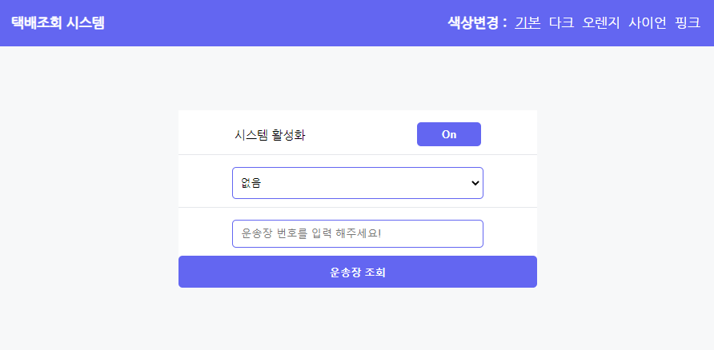

# Delivery-Tracking-App - 택배 조회 서비스


스마트택배 API를 활용하여 나의 택배 현황 조회 웹 페이지 구현하기

## 프로젝트 진행 목적

- `React` `Typescript`로 API data 다루기
- 컴포넌트 모듈화
- `async`, `await`로 비동기 프로그래밍 코드 작성
- `CSS` module 관리로, 컴포넌트별 CSS 관리 편리 및 클래스 명의 전역 중복(오염) 방지
- `Fetch`로 API 데이터 통신
- `vite create` 및 `netlify` 배포
- 사용자의 입맛대로 `커스텀 테마` (5종)

<br>

## 최종 구현 화면

- netlify - [https://delivery-tracking-sst.netlify.app/](https://delivery-tracking-sst.netlify.app/)



<br>

## 구현 요구 사항 목록

- [O] `Fetch`로 API data 통신 및 상태 관리
- [O] 스마트택배 API 연동
- [O] 실시간 배송상태 데이터 렌더링
- [O] 높은 가독성 및 쉬운 사용법, 접근성을 고려한 심플한 UI

<br>

## 사용한 프레임워크 및 라이브러리 설명

- React: 컴포넌트 기반의 화면구성, Virtual DOM으로 인한 속도 향상, SPA(싱글 페이지 애플리케이션)
- TypeScript: 초기 데이터와 컴포넌트 사이에 전달되는 데이터의 컴파일 오류를 방지하기 위해 사용
- Fetch: 데이터 패칭시 로딩, 에러 state 관리를 쉽게 하기 위해 사용
- *.module.css: className 중복방지 및 유지보수에 용이하기 위해 사용
- Vite: build 속도를 빠르게 하기 위해 사용

## 실행 방법

```
git clone https://github.com/sstipdev/Delivery-Tracking-App

yarn -i

yarn run dev
```